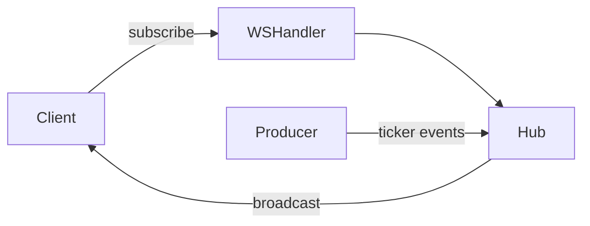

# Go Real-Time Market Data WebSocket Server


Production-style real-time market data WebSocket server in Go, designed for high-concurrency and scalable backend systems


## System Flow



## Tech Stack

Go, WebSocket, net/http, goroutines, channels, Docker, structured logging

## Why This Project Exists

Portfolio projects for backend roles should show more than a basic WebSocket echo server.

This repository demonstrates how to build a clean real-time delivery pipeline with idiomatic Go primitives (goroutines, channels, context, net/http) while keeping the code interview-friendly.

## Architecture Overview

- `cmd/wsserver/main.go`
  - app wiring, config loading, logger setup, HTTP server startup/shutdown
- `internal/config`
  - environment-based runtime config
- `internal/websocket`
  - connection upgrade handler
  - hub runtime (register/unregister/subscribe/unsubscribe/broadcast)
  - client read/write loops (ping-pong, rate limiting, buffered send)
  - protocol DTOs and subscription validation
- `internal/marketdata`
  - mock ticker producer for multiple symbols

Data flow:
1. Client connects to `/ws`.
2. Client sends `subscribe` request with channel + symbol.
3. Hub indexes subscription per client and per topic.
4. Mock producer emits ticker updates periodically.
5. Hub broadcasts only to matching subscribers.

## Features

- Multiple concurrent WebSocket clients
- Multi-symbol subscriptions (`BTCUSDT`, `ETHUSDT`, `SOLUSDT` by default)
- Extensible channel model (ticker enabled now)
- Subscribe/unsubscribe operations
- Per-client subscription tracking in hub indexes
- Non-blocking buffered delivery to avoid hub stalls
- Slow-client disconnect protection
- Ping/pong heartbeat support
- Basic per-client message rate limiting
- Structured JSON logging via `log/slog`
- Graceful shutdown with signal handling (`SIGINT`, `SIGTERM`)

## Message Format

### Subscribe Request

```json
{
  "op": "subscribe",
  "args": [
    { "channel": "ticker", "symbol": "BTCUSDT" },
    { "channel": "ticker", "symbol": "ETHUSDT" }
  ]
}
```

### Subscribe Acknowledgement

```json
{
  "type": "ack",
  "op": "subscribe",
  "result": "ok",
  "args": [
    { "channel": "ticker", "symbol": "BTCUSDT" },
    { "channel": "ticker", "symbol": "ETHUSDT" }
  ]
}
```

### Pushed Ticker Event

```json
{
  "type": "event",
  "channel": "ticker",
  "symbol": "BTCUSDT",
  "data": {
    "symbol": "BTCUSDT",
    "last_price": "65102.14",
    "open_24h": "64780.50",
    "high_24h": "65311.22",
    "low_24h": "64290.74",
    "volume_24h": "1342.0198",
    "change_24h": "+321.64",
    "change_percent_24h": "+0.50",
    "best_bid": "65089.12",
    "best_ask": "65115.16",
    "event_time": 1760000000000
  },
  "ts": 1760000000000
}
```

### Error Example

```json
{
  "type": "error",
  "code": "invalid_subscription",
  "message": "unsupported channel"
}
```

## Run Locally

Requirements:
- Go `1.23+`

```bash
go run ./cmd/wsserver
```

Server defaults:
- HTTP/WebSocket address: `:5002`
- WebSocket endpoint: `/ws`
- Health endpoint: `/healthz`

## Run With Docker

```bash
docker compose up --build
```

## Environment Variables

- `ADDR` (default `:5002`)
- `LOG_LEVEL` (`debug|info|warn|error`, default `info`)
- `SYMBOLS` (comma-separated, default `BTCUSDT,ETHUSDT,SOLUSDT`)
- `PRODUCER_INTERVAL` (default `2s`)
- `CLIENT_RATE_LIMIT` (messages/sec per client, default `20`)
- `WS_SEND_BUFFER` (default `64`)
- `WS_READ_LIMIT_BYTES` (default `4096`)
- `WS_WRITE_TIMEOUT` (default `10s`)
- `WS_PONG_WAIT` (default `60s`)
- `WS_PING_INTERVAL` (default `54s`)
- `SHUTDOWN_TIMEOUT` (default `10s`)

## Design Decisions

- Hub state is owned by a single goroutine to simplify concurrency safety.
- Subscription access is indexed in two directions:
  - client -> subscriptions
  - subscription -> clients
  This keeps unsubscribe and broadcast efficient.
- Outbound client channels are buffered and pushed non-blockingly.
  Slow consumers are disconnected to protect system throughput.
- Rate limiting is intentionally simple and local to each client loop.

## Future Improvements

- Persistent market source integration (Kafka/NATS/Redis streams)
- Authenticated/private channels
- Metrics endpoint (Prometheus)
- Integration tests with real WebSocket clients
- Channel-specific validation and authorization policies

## Portfolio Note
This project is a compact showcase of backend engineering patterns commonly used in real-time trading and market data systems.